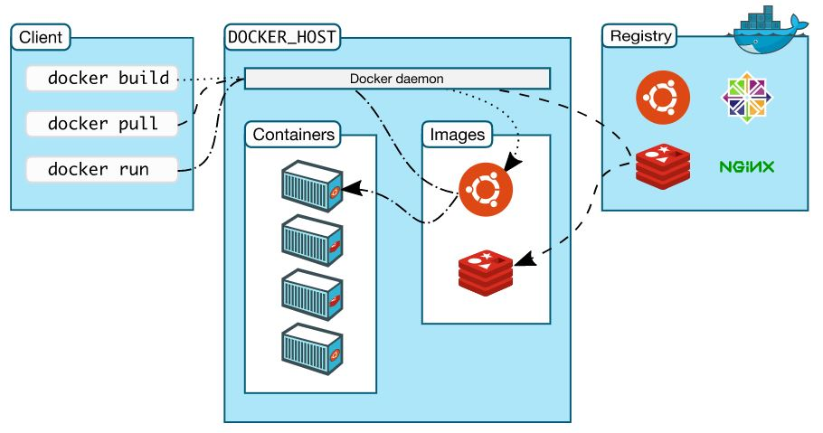

# What is Docker

"Shpping container for software" - Open platform for developing, shipping, and running applications

## Why Docker

- fast, consistent delivery of your applications
- containers are great for continuous integration and continuous delivery (CI/CD) workflows.

Consider the following example scenario:

- Your developers write code locally and share their work with their colleagues using Docker containers.
- They use Docker to push their applications into a test environment and execute automated and manual tests.
- When developers find bugs, they can fix them in the development environment and redeploy them to the test environment for testing and validation.
- When testing is complete, getting the fix to the customer is as simple as pushing the updated image to the production environment.

## Docker Image

- building blocks of the Docker world
- build part of docker lifecycle
- high portable across hosts and environments
- run everywhere (any host that runs Docker)

## Docker Registries

- store Docker images
- two type: public and private

## Docker Container

- a running docker image

## Docker Architecture

